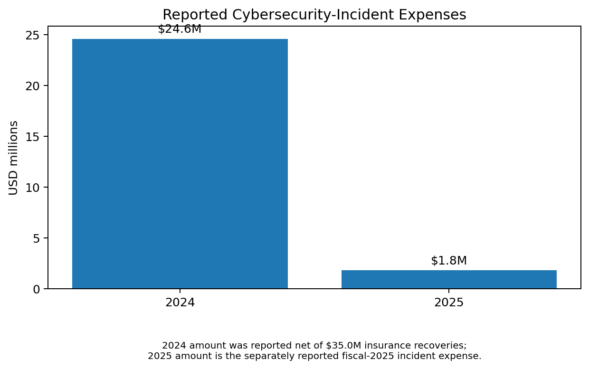
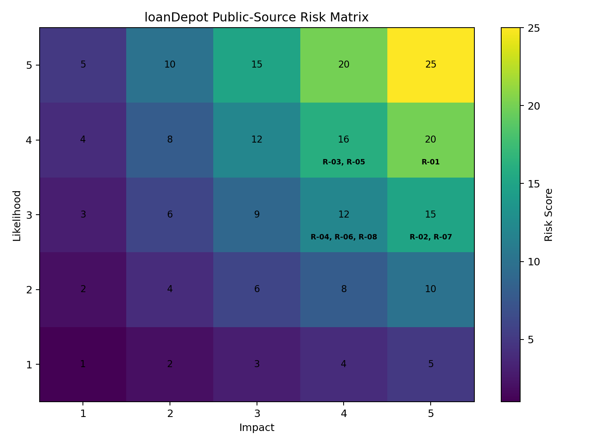
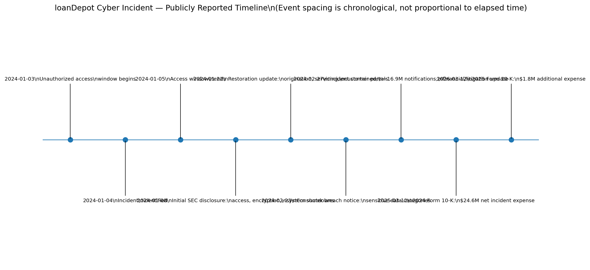

# loanDepot Public-Source Cybersecurity Risk Assessment

A public-source cybersecurity risk assessment that uses **publicly available evidence** from SEC filings, state breach notifications, and NIST CSF 2.0 to analyze cybersecurity risk themes connected to loanDepot's January 2024 cyber incident.

This project is intentionally different from a fictional risk register: the **facts come from public sources**, while the risk scores, analysis, and recommendations are clearly labeled as analyst judgment.

> **Important:** This is an independent educational project. It is not an audit of loanDepot, is not affiliated with loanDepot, and does not claim access to internal systems, logs, policies, or control-testing evidence.

## Why I Built This

I wanted to practice translating real cybersecurity events into a structured risk-management workflow rather than creating risks for an entirely fictional company.

The project follows this path:

**Public evidence → evidence register → risk statements → likelihood/impact scoring → risk prioritization → control observations → recommendations → NIST CSF 2.0 mapping**

## Incident Snapshot

Public disclosures show that an unauthorized third party accessed certain loanDepot systems and encrypted data. loanDepot shut down certain systems during its response and later reported restoring loan-origination, loan-servicing, and customer-portal systems.

Regulatory breach notices describe potentially affected information including names, addresses, email addresses, financial account numbers, Social Security numbers, phone numbers, and dates of birth.

A Maine breach record reported **16,924,071 affected individuals**. loanDepot later reported **$24.6 million of cybersecurity-incident expenses in fiscal 2024, net of $35.0 million of insurance recoveries**, followed by **$1.8 million of incident-related expenses in fiscal 2025**.

See [`data/evidence-register.csv`](data/evidence-register.csv) and [`documentation/sources.md`](documentation/sources.md) for the evidence trail.

## Reported Incident Expenses



## What I Did *Not* Assume

Public sources reviewed for this project do **not** establish the technical root cause of the intrusion.

For example, I do not claim that:

- a missing MFA control caused the breach,
- a specific vulnerability was exploited,
- a third-party vendor caused the incident,
- loanDepot lacked encryption, EDR, SIEM, segmentation, or another specific technology,
- the incident was ransomware simply because data was encrypted.

Where the public record ends, the project says so.

## Risk Matrix



The scores are **analytical assessments based on the public evidence**, not loanDepot's internal risk ratings.

| Risk | Theme | Score | Rating |
|---|---|---:|---|
| R-01 | Sensitive data exposure and identity theft | 20 | Critical |
| R-02 | Operational disruption and service availability | 15 | High |
| R-03 | Legal and regulatory exposure | 16 | Critical |
| R-04 | Financial loss and insurance-recovery uncertainty | 12 | High |
| R-05 | Recurrence and future targeting | 16 | Critical |
| R-06 | Third-party and supply-chain cyber risk | 12 | High |
| R-07 | Incident response and recovery execution | 15 | High |
| R-08 | Reputation and customer trust | 12 | High |

## Incident Timeline



The timeline is built from SEC filings and state breach-notification material rather than media reconstruction.

## Publicly Disclosed Security Controls

A major part of this project is avoiding the assumption that a breached company had "no security."

loanDepot's 2025 Form 10-K publicly describes controls and governance including:

- dedicated technology-risk, cybersecurity-operations, cybersecurity-engineering, and identity/access-management teams,
- penetration and vulnerability testing,
- data-recovery testing,
- security audits and ongoing risk assessments,
- due diligence and audits of key technology vendors,
- phishing and cybersecurity training/simulations,
- outside cybersecurity advisors,
- third-party incident monitoring and response,
- CISO and senior-leadership oversight,
- Enterprise Risk Management Committee discussion,
- Board and Audit Committee cybersecurity oversight and incident-escalation protocols.

I therefore use [`data/control-observations.csv`](data/control-observations.csv) to document what is publicly disclosed and identify the **evidence I would request if this were a real internal review**.

## Repository Structure

```text
loanDepot-Public-Cyber-Risk-Assessment/
├── README.md
├── data/
│   ├── sources.csv
│   ├── evidence-register.csv
│   ├── risk-register.csv
│   ├── control-observations.csv
│   ├── incident-timeline.csv
│   └── impact-metrics.csv
├── documentation/
│   ├── methodology.md
│   ├── incident-analysis.md
│   ├── control-review.md
│   ├── assumptions-and-limitations.md
│   ├── nist-csf-mapping.md
│   └── sources.md
├── tools/
│   ├── risk_calculator.py
│   ├── generate_visuals.py
│   └── validate_project.py
├── visuals/
│   ├── risk-matrix.png
│   ├── incident-timeline.png
│   └── cyber-expenses.png
├── reports/
│   └── validation-summary.txt
└── .gitignore
```

## Method

### 1. Collect evidence

I prioritized first-party and regulatory sources:

1. SEC filings
2. State attorney-general breach notifications
3. NIST CSF 2.0 for framework mapping

### 2. Separate fact from analysis

Every major factual input receives an **Evidence ID** (`E-01`, `E-02`, etc.).

The risk register then points back to those Evidence IDs.

### 3. Write risk statements

Risk statements describe a potential business outcome rather than treating a technical finding as the risk itself.

Example:

> **Fact:** Systems were shut down and later restored.  
> **Risk analysis:** A future cyber incident that forces critical systems offline could interrupt mortgage origination and servicing.

### 4. Score risk

I used a simple 5×5 qualitative model:

**Risk Score = Likelihood × Impact**

| Score | Rating |
|---:|---|
| 1–4 | Low |
| 5–9 | Medium |
| 10–15 | High |
| 16–25 | Critical |

The methodology and limitations are documented in [`documentation/methodology.md`](documentation/methodology.md).

### 5. Review controls without inventing gaps

Instead of saying "loanDepot should implement penetration testing" when its public filings say it already performs testing, I document the control and ask what evidence would be needed to evaluate it.

That distinction is central to the project.

### 6. Map to NIST CSF 2.0

The project maps risks and recommendations at a high level to NIST CSF 2.0 categories across **Govern, Identify, Protect, Detect, Respond, and Recover**.

This is a reference mapping, **not a formal NIST compliance assessment**.

## Automation

The repository includes three small Python utilities:

### Risk calculator

```bash
python tools/risk_calculator.py
```

### Project validation

```bash
python tools/validate_project.py
```

Checks:

- duplicate IDs,
- likelihood/impact ranges,
- risk-score math,
- rating consistency,
- risk-to-evidence references,
- control-to-evidence references.

### Visual generation

```bash
python tools/generate_visuals.py
```

Rebuilds the risk matrix, incident timeline, and incident-expense chart from project data.

## Skills Demonstrated

- Cybersecurity risk identification
- Evidence-based analysis
- Risk-register development
- Likelihood and impact scoring
- Distinguishing facts from assumptions
- Control and audit-evidence thinking
- Incident/business-impact analysis
- NIST CSF 2.0 mapping
- GRC documentation
- Basic Python automation and data validation
- Public-source research

## Disclaimer

This project is an independent analysis using public information. Risk scores and recommendations are independent analysis and do not represent loanDepot's internal assessments, control effectiveness, or official positions.
